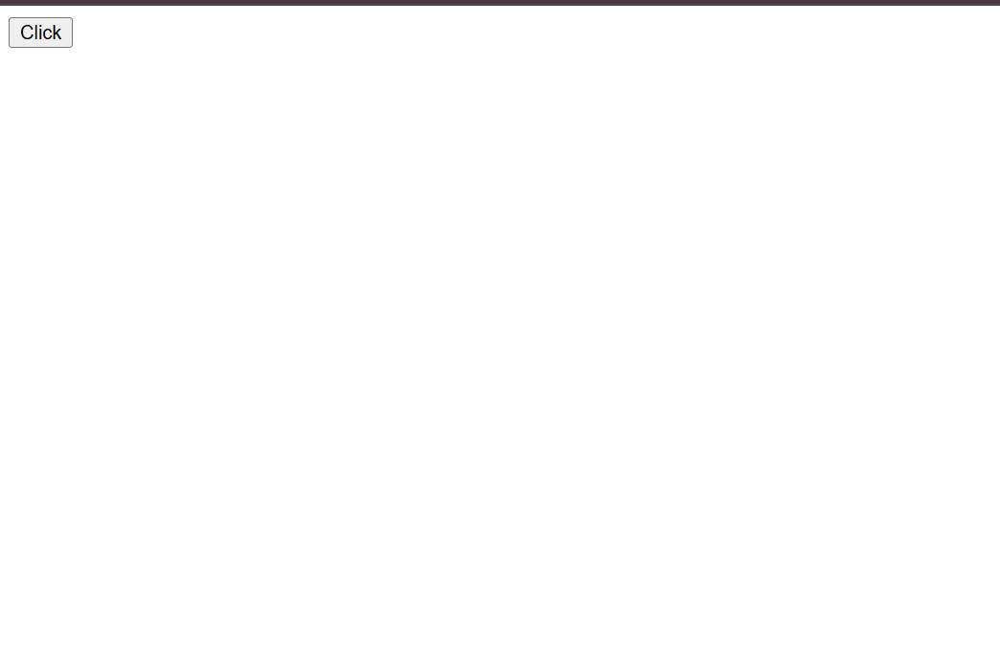
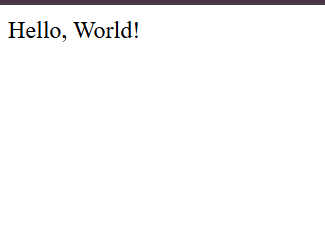
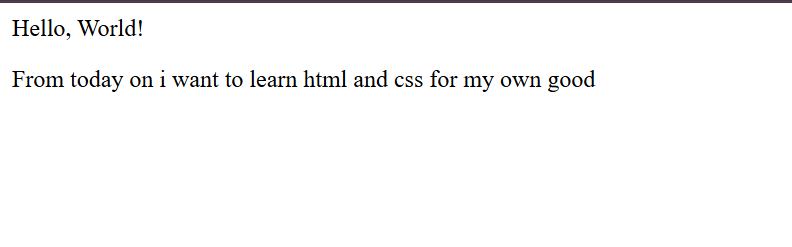
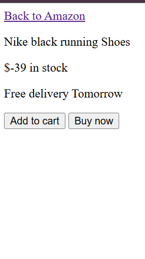

# 🚀 My HTML & CSS Learning Journey

Welcome to my portfolio! Here is the clean track of my daily course files with visual outputs. All screenshots are neatly organized without messing up the code folders.

---

## 📚 1. Course Lessons (Channel Code)

### 📁 html-css
* **HTML Basics Output:**
  
    
* **CSS Basics Button Output:**
  

---

## 📝 2. Practice Exercises

### 📁 practice exercises / html basic Exercise
* **Exercise 1a Output:** 
* **Exercise 1b Output:** 
* **Exercise 1c Output:** 
* **Exercise 1d Output:** 
* **Exercise 1e Output:** 
* **Exercise 1f Output:** 

---
*Note: CSS exercise screenshots will be added here once uploaded.*
