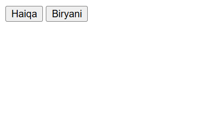

# 📝 HTML Basic Exercise Outputs

Is folder mein meri solve ki hui HTML exercises ke saare live screenshots hain.

### 🖼️ Exercise 1a Output

### 🖼️ Exercise 1b Output

### 🖼️ Exercise 1c Output

### 🖼️ Exercise 1d Output

### 🖼️ Exercise 1e Output

### 🖼️ Exercise 1f Output

